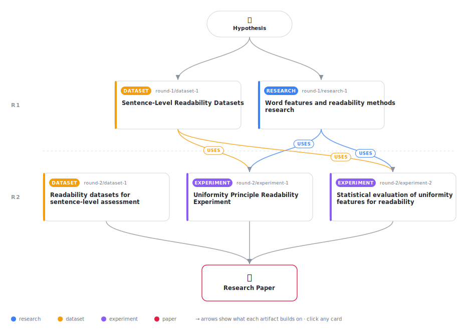

# The Uniformity Principle: How Within-Sentence Consistency Predicts Readability

<div align="center">

<a href="https://cdn.jsdelivr.net/gh/AMGrobelnik/ai-invention-fea63a-the-uniformity-principle-how-within-sent@main/workflow.svg">
<picture>
  <source media="(prefers-color-scheme: dark)" srcset="workflow-dark.svg">
  
</picture>
</a>

<sub>🖱️ <b><a href="https://cdn.jsdelivr.net/gh/AMGrobelnik/ai-invention-fea63a-the-uniformity-principle-how-within-sent@main/workflow.svg">Open the interactive diagram</a></b> — every card links to its artifact folder.</sub>

</div>

> **TL;DR** — This paper introduces the Uniformity Principle: the hypothesis that within-sentence uniformity of word-level linguistic features (measured by coefficient of variation of word length, syllables, and word frequency) predicts readability independently of traditional average features. Through systematic evaluation on 13,129 sentences from WeeBIT and CEFR-SP datasets with rigorous statistical testing (bootstrap confidence intervals, effect sizes, ablation studies), we demonstrate that uniformity features provide statistically significant predictive power beyond traditional features (p < 0.001), yielding R² improvements of +0.127 and +0.046 with large effect sizes (Cohen's d = 1.55 and 2.40). The coefficient of variation of syllable counts is the most robust uniformity predictor. These findings suggest that the Uniformity Principle captures a previously unrecognized aspect of readability, providing a lightweight and interpretable enhancement to traditional readability assessment.

<details>
<summary>Full hypothesis</summary>

The readability of a sentence is predicted not only by average linguistic complexity (e.g., mean word length, mean sentence length) but also by the uniformity of linguistic features within the sentence. Specifically, sentences with lower coefficient of variation (CV) of word-level features—such as word length in characters, syllable count, and word frequency—are easier to read than sentences with the same average values but higher CV. Initial experiments on 13,129 sentences from WeeBIT and CEFR-SP datasets show that adding uniformity features (CV of word length, syllables, frequency) to traditional average features yields statistically significant R² improvements of +0.127 (WeeBIT, 95% CI [0.091, 0.153]) and +0.046 (CEFR-SP, 95% CI [0.037, 0.053]), both p < 0.001 with large effect sizes (Cohen's d = 1.55 and 2.40). The coefficient of variation of syllable counts (cv_syllables) is the most predictive uniformity feature (β = 0.141 on WeeBIT, 95% CI [0.125, 0.157]). However, these initial results use suboptimal word frequency norms (NLTK Gutenberg corpus) and evaluate only against Ridge regression baselines. To fully confirm the Uniformity Principle and establish its contribution beyond modern readability methods, subsequent experiments must: (1) use high-quality word frequency norms (SUBTLEX-US rather than NLTK Gutenberg), (2) compare against modern baselines (BERT-based models, LingFeat), (3) evaluate on additional datasets (e.g., CLEAR corpus), and (4) test generalizability to document-level readability.

</details>

[](https://cdn.jsdelivr.net/gh/AMGrobelnik/ai-invention-fea63a-the-uniformity-principle-how-within-sent@main/paper.pdf) [](https://github.com/AMGrobelnik/ai-invention-fea63a-the-uniformity-principle-how-within-sent/tree/main/paper_latex)

This repository contains all **5 artifacts** produced across **2 rounds** of an autonomous AI research run — round by round, exactly in the order they were invented.

## Round 1

| Artifact | Type | Demo | Source | Builds on |
|----------|------|------|--------|-----------|
| **[Word features and readability methods research](https://github.com/AMGrobelnik/ai-invention-fea63a-the-uniformity-principle-how-within-sent/tree/main/round-1/research-1)** | [](https://github.com/AMGrobelnik/ai-invention-fea63a-the-uniformity-principle-how-within-sent/tree/main/round-1/research-1) | [](https://github.com/AMGrobelnik/ai-invention-fea63a-the-uniformity-principle-how-within-sent/blob/main/round-1/research-1/demo/research_demo.md) | [](https://github.com/AMGrobelnik/ai-invention-fea63a-the-uniformity-principle-how-within-sent/tree/main/round-1/research-1/src) | — |
| **[Sentence-Level Readability Datasets](https://github.com/AMGrobelnik/ai-invention-fea63a-the-uniformity-principle-how-within-sent/tree/main/round-1/dataset-1)** | [](https://github.com/AMGrobelnik/ai-invention-fea63a-the-uniformity-principle-how-within-sent/tree/main/round-1/dataset-1) | [](https://colab.research.google.com/github/AMGrobelnik/ai-invention-fea63a-the-uniformity-principle-how-within-sent/blob/main/round-1/dataset-1/demo/data_code_demo.ipynb) | [](https://github.com/AMGrobelnik/ai-invention-fea63a-the-uniformity-principle-how-within-sent/tree/main/round-1/dataset-1/src) | — |

## Round 2

| Artifact | Type | Demo | Source | Builds on |
|----------|------|------|--------|-----------|
| **[Readability datasets for sentence-level assessment](https://github.com/AMGrobelnik/ai-invention-fea63a-the-uniformity-principle-how-within-sent/tree/main/round-2/dataset-1)** | [](https://github.com/AMGrobelnik/ai-invention-fea63a-the-uniformity-principle-how-within-sent/tree/main/round-2/dataset-1) | [](https://colab.research.google.com/github/AMGrobelnik/ai-invention-fea63a-the-uniformity-principle-how-within-sent/blob/main/round-2/dataset-1/demo/data_code_demo.ipynb) | [](https://github.com/AMGrobelnik/ai-invention-fea63a-the-uniformity-principle-how-within-sent/tree/main/round-2/dataset-1/src) | — |
| **[Uniformity Principle Readability Experiment](https://github.com/AMGrobelnik/ai-invention-fea63a-the-uniformity-principle-how-within-sent/tree/main/round-2/experiment-1)** | [](https://github.com/AMGrobelnik/ai-invention-fea63a-the-uniformity-principle-how-within-sent/tree/main/round-2/experiment-1) | [](https://colab.research.google.com/github/AMGrobelnik/ai-invention-fea63a-the-uniformity-principle-how-within-sent/blob/main/round-2/experiment-1/demo/method_code_demo.ipynb) | [](https://github.com/AMGrobelnik/ai-invention-fea63a-the-uniformity-principle-how-within-sent/tree/main/round-2/experiment-1/src) | <sub><i>uses:</i><br/>[dataset‑1&nbsp;(R1)](https://github.com/AMGrobelnik/ai-invention-fea63a-the-uniformity-principle-how-within-sent/tree/main/round-1/dataset-1)<br/>[research‑1&nbsp;(R1)](https://github.com/AMGrobelnik/ai-invention-fea63a-the-uniformity-principle-how-within-sent/tree/main/round-1/research-1)</sub> |
| **[Statistical evaluation of uniformity features for readabilit…](https://github.com/AMGrobelnik/ai-invention-fea63a-the-uniformity-principle-how-within-sent/tree/main/round-2/experiment-2)** | [](https://github.com/AMGrobelnik/ai-invention-fea63a-the-uniformity-principle-how-within-sent/tree/main/round-2/experiment-2) | [](https://colab.research.google.com/github/AMGrobelnik/ai-invention-fea63a-the-uniformity-principle-how-within-sent/blob/main/round-2/experiment-2/demo/method_code_demo.ipynb) | [](https://github.com/AMGrobelnik/ai-invention-fea63a-the-uniformity-principle-how-within-sent/tree/main/round-2/experiment-2/src) | <sub><i>uses:</i><br/>[dataset‑1&nbsp;(R1)](https://github.com/AMGrobelnik/ai-invention-fea63a-the-uniformity-principle-how-within-sent/tree/main/round-1/dataset-1)<br/>[research‑1&nbsp;(R1)](https://github.com/AMGrobelnik/ai-invention-fea63a-the-uniformity-principle-how-within-sent/tree/main/round-1/research-1)</sub> |

## Repository Structure

Artifacts are grouped by the round of invention that produced them. Each
artifact has its own folder with source code and a self-contained demo:

```
.
├── round-1/                         # One folder per round of invention
│   ├── experiment-1/
│   │   ├── README.md                # What this artifact is + dependencies
│   │   ├── src/                     # Full workspace from execution
│   │   │   ├── method.py            # Main implementation
│   │   │   ├── method_out.json      # Full output data
│   │   │   └── ...                  # All execution artifacts
│   │   └── demo/                    # Self-contained demo
│   │       └── method_code_demo.ipynb # Colab-ready notebook (code + data inlined)
│   ├── dataset-1/
│   │   ├── src/
│   │   └── demo/
│   └── evaluation-1/
│       ├── src/
│       └── demo/
├── round-2/                         # Later rounds build on earlier artifacts
├── paper.pdf                        # Research paper
├── paper_latex/                     # LaTeX source files
├── workflow.svg                     # Artifact dependency diagram (this page's header)
└── README.md
```

## Running Notebooks

### Option 1: Google Colab (Recommended)

Click the "Open in Colab" badges above to run notebooks directly in your browser.
No installation required!

### Option 2: Local Jupyter

```bash
# Clone the repo
git clone https://github.com/AMGrobelnik/ai-invention-fea63a-the-uniformity-principle-how-within-sent
cd ai-invention-fea63a-the-uniformity-principle-how-within-sent

# Install dependencies
pip install jupyter

# Run any artifact's demo notebook
jupyter notebook <artifact_folder>/demo/
```

## Source Code

The original source files are in each artifact's `src/` folder.
These files may have external dependencies - use the demo notebooks for a self-contained experience.

---
*Generated by AI Inventor Pipeline - Automated Research Generation*
